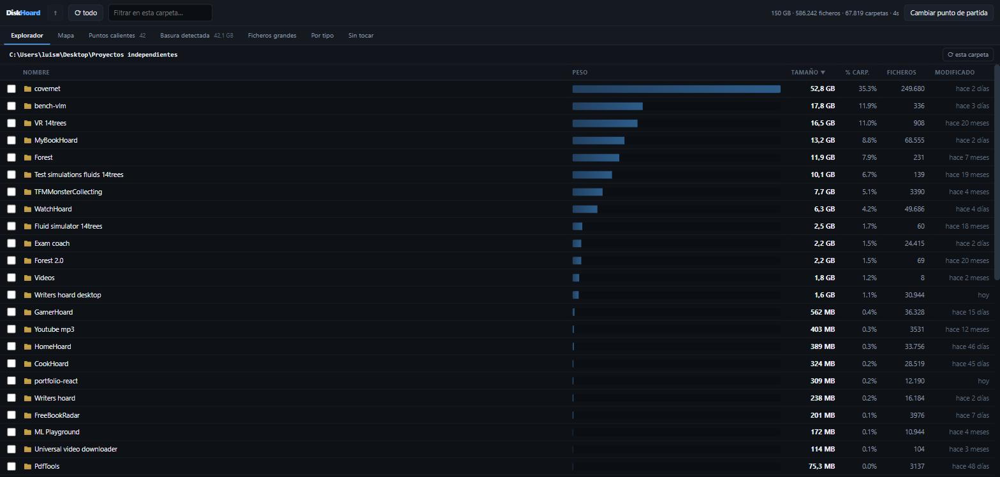
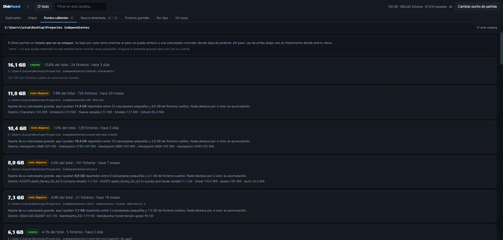
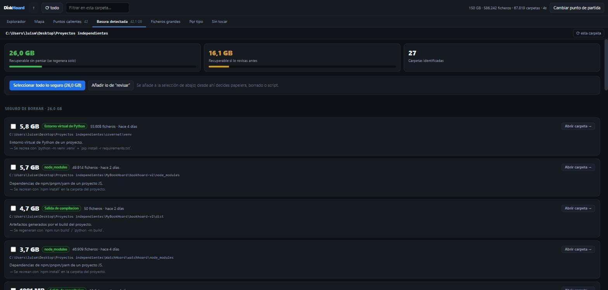
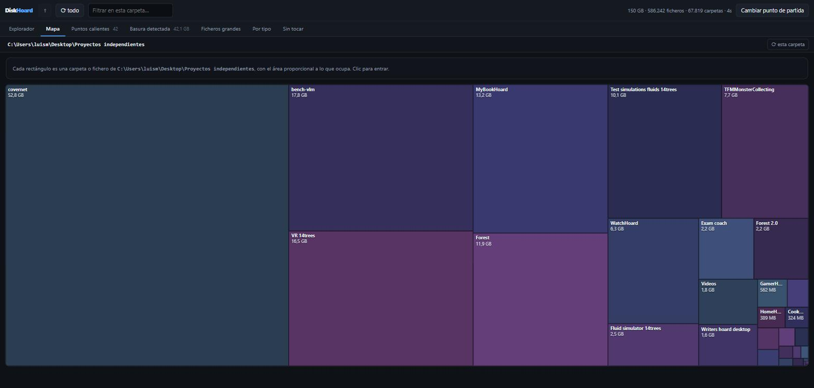

# DiskHoard

Analizador y limpiador de disco para Windows. Escanea el árbol que le digas, te enseña
**cuánto pesa cada carpeta por nivel**, te dice **dónde se concentra el peso de verdad** y
te deja borrar desde la propia interfaz.

Nace de un problema concreto: tener cientos de gigas ocupados sin saber en qué, y acabar
abriendo *Propiedades* carpeta por carpeta, bajando un nivel cada vez que aparece una
gorda. El explorador de Windows sabe la respuesta pero no te la da.

Sin dependencias: Python 3 de la librería estándar y el navegador que ya tienes.



## Uso

Doble clic en `DiskHoard.bat`. Se abre el navegador en `127.0.0.1`.

1. Eliges punto de partida: una unidad entera, un atajo (Escritorio, Descargas, AppData…)
   o una ruta a mano.
2. Escanea.
3. Navegas por niveles. Cada fila lleva su barra de peso, su tamaño, el porcentaje que se
   lleva de la carpeta actual, cuántos ficheros contiene y cuándo se tocó por última vez.

`DiskHoard (admin).bat` hace lo mismo como administrador, para que no aparezcan carpetas
del sistema marcadas como «sin permiso».

También hay modo consola, sin navegador:

```
python selftest.py "C:\ruta\a\escanear"
```

## Qué enseña

### Puntos calientes

La respuesta directa a *«¿dónde están mis 300 GB?»*. No es un ranking de carpetas —eso
repite abuelo, padre e hijo y no dice nada—, sino una **partición en trozos que no se
solapan**: baja por cada rama mientras el peso se pueda atribuir a una subcarpeta
concreta, y donde deja de poderse, para y lo apunta. Lo que queda repartido entre muchas
cosas pequeñas se marca como «resto disperso».



### Basura detectada

Un catálogo de carpetas conocidas: `node_modules`, entornos virtuales, cachés de
conda/pip/npm/Gradle/Maven, `target/` de Rust, `Library/` de Unity, intermedios de Unreal,
modelos de Ollama y Hugging Face, temporales de Windows, papelera, discos de Docker y WSL…

Cada una viene con **qué es, si se puede borrar y cómo se regenera**, clasificada en tres
niveles:

| | |
|---|---|
| **Seguro de borrar** | se regenera solo (`npm install`, `cargo build`, la app rehace su caché) |
| **Revisar antes** | pesado y recuperable, pero igual tardaste horas en bajarlo |
| **No tocar** | `Windows\Installer`, `WinSxS`, `.git`, `pagefile.sys`… ni seleccionable |

Las reglas usan marcadores para no dar falsos positivos: `target/` solo cuenta si hay un
`Cargo.toml` al lado, `Library/` solo si hay un `Assets/`, `venv/` solo si contiene un
`pyvenv.cfg`. Y algunas carpetas son cajones de sastre (`.cache`, `Descargas`,
`LocalCache`): se informan pero se sigue bajando dentro, y no suman en el total
recuperable para no contar dos veces.



### Mapa

Treemap de la carpeta actual: el área de cada rectángulo es lo que ocupa. Clic para
entrar.



### Y además

- **Ficheros grandes** — los 500 más pesados del escaneo, con nota para los sospechosos
  habituales (`hiberfil.sys`, `pagefile.sys`, `.vhdx`, copias `.blend1` de Blender).
- **Por tipo** — en qué se te va el disco por categoría: vídeo, modelos de IA, discos
  virtuales, comprimidos, código…
- **Sin tocar** — carpetas de más de 1 GB cuyo fichero más reciente tiene más de un año.

## Borrado

Seleccionas con las casillas y decides:

- **Mover a la papelera** — reversible, vía `SHFileOperation` con `FOF_ALLOWUNDO`.
- **Borrar definitivamente** — no pasa por la papelera. Rápido e irreversible.
- **Generar script** — un `.ps1` comentado que revisas y ejecutas tú, con soporte de
  `-WhatIf` para ver qué haría sin tocar nada.

Nada se borra sin confirmación explícita en un diálogo que lista lo seleccionado y avisa
si hay algo marcado como «no tocar». Tras borrar, **⟳ esta carpeta** vuelve a leer solo
ese subárbol en un par de segundos y te dice cuánto ha cambiado.

## Atajos

| Tecla | Acción |
|---|---|
| Retroceso | subir un nivel |
| Supr | mover la selección a la papelera |
| Ctrl+A | seleccionar todo en la carpeta actual |
| Esc | limpiar selección / cerrar diálogo |

## Cómo funciona por dentro

- **Escaneo multihilo con `os.scandir`.** En Windows la enumeración de un directorio ya
  devuelve los metadatos de cada entrada, así que `entry.stat()` no cuesta una llamada
  extra al sistema. De ahí la diferencia de velocidad con el explorador.
- **En memoria solo viven los directorios** (tamaño acumulado, número de ficheros, fecha
  más reciente). Los ficheros de una carpeta se listan en vivo al entrar, que es
  instantáneo y siempre está al día después de borrar.
- **Los tamaños se agregan en un recorrido post-orden iterativo**, no recursivo: hay
  árboles de `node_modules` que revientan la pila.
- **Rutas largas con prefijo `\\?\`** en todo el escaneo, porque `node_modules` pasa de
  260 caracteres constantemente. (Ojo: `SHFileOperation` no acepta ese prefijo, así que la
  papelera trabaja con la ruta normal.)
- **No se siguen *junctions* ni enlaces simbólicos.** Si se siguen, el mismo contenido se
  cuenta varias veces y los totales mienten.
- **Servidor local** con `http.server`, escuchando solo en `127.0.0.1` y con un token
  aleatorio distinto en cada arranque. La interfaz entera es un único fichero HTML sin
  dependencias externas.

### Rendimiento

Medido en un NVMe con Windows 11:

| Objetivo | Tamaño | Ficheros | Carpetas | Tiempo |
|---|---|---|---|---|
| `C:\` completo | 1,54 TB | 3,72 M | 677 k | 56 s |
| Perfil de usuario | 1,17 TB | 2,88 M | 463 k | 33 s |

Unos 50-90 k ficheros por segundo según lo caliente que esté la caché del sistema.

## Estructura

```
DiskHoard/
├── DiskHoard.bat          arranque normal
├── DiskHoard (admin).bat  arranque como administrador
├── selftest.py            modo consola
└── diskhoard/
    ├── scanner.py         motor de escaneo multihilo
    ├── junk.py            catálogo de basura + puntos calientes
    ├── winfs.py           rutas largas, unidades, papelera, borrado
    ├── server.py          servidor HTTP local + API
    └── web/index.html     interfaz entera en un fichero
```

## Limitaciones

- Solo Windows. El motor de escaneo es portable, pero la papelera y la enumeración de
  unidades usan la API de Windows.
- La interfaz está solo en castellano.
- Los tamaños son lógicos, no *tamaño en disco*: no tiene en cuenta compresión NTFS,
  ficheros dispersos ni el tamaño de clúster.

## Licencia

MIT. Ver [LICENSE](LICENSE).
