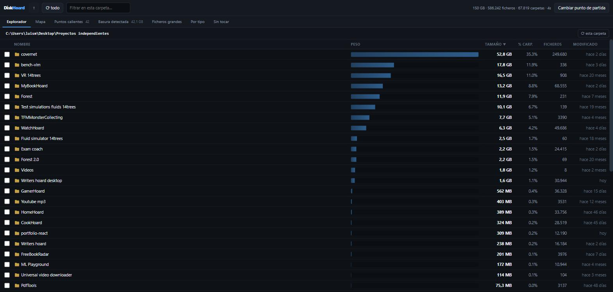
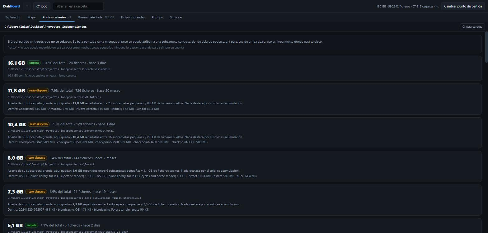

# DiskHoard

[Español](README.es.md)

A local disk explorer and cleaner for Windows. Scan a drive or folder, see **where the space actually goes**, browse folder sizes by level, clean from the interface and split a folder into ZIPs that each stay under a size limit. It uses Python's standard library and a browser; its MCP stdio server lets Faustus or another assistant use the same scan and cleanup tools.



## Start

Double-click `DiskHoard.bat` to open the local interface at `127.0.0.1`. Choose a drive, a shortcut such as Desktop or Downloads, or a path, then scan and browse. `DiskHoard (admin).bat` can include system folders that a normal scan cannot read. For a console-only check:

```sh
python selftest.py "C:\path\to\scan"
```

The last completed folder scan is cached in `data/last-scan.pkl.gz` and restored on launch. Assistant tools report its age as `snapshot.age_h`; `disk_scan` refreshes it. Set `DISKHOARD_RESTORE=0` to disable restore.

## What the explorer shows

- **Hotspots:** a non-overlapping partition of the disk usage. The algorithm descends through each branch until it can attribute weight to a specific subfolder and groups scattered remainder separately.
- **Known reclaimable folders:** `node_modules`, virtual environments, package caches, build artifacts, model caches, GPU shaders, Windows temporary files, Docker/WSL disks and more. Each rule explains what it is, how it regenerates and whether deletion is safe, needs review or must be avoided. Context checks prevent false positives such as treating any folder named `target` as Rust output.
- **Treemap, large files, file types and stale folders:** browse visually, inspect the 500 largest files, understand categories and find large folders untouched for over a year.



## Cleanup

Choose **Move to Recycle Bin**, **Delete permanently** or **Generate script**. The PowerShell script is reviewable and supports `-WhatIf`. A confirmation dialog names every target before deletion. Afterward, rescan just that subtree to see the effect. Permanent deletion is irreversible.

The assistant can never delete drive roots, the user profile and main folders, Windows, Program Files, ProgramData or other protected targets. The MCP layer applies the same rules as the UI.

## Split into ZIPs

The **Split into ZIPs** panel (the "Partir en ZIPs" tab, the start-screen button, and the buttons on the folder bar and selection bar) turns a folder into `part_001.zip`, `part_002.zip`... where no part exceeds a limit, for upload sites with a per-file cap. It replaces the old Tkinter "Zip splitter".

- **Limit:** `990mb` (decimal, 1 MB = 1,000,000 bytes), `990mib` (binary) or plain bytes; quick buttons for 25 MB, 100 MB, 500 MB, 990 MB, 2 GB and 4 GB. Default margin 5 MB.
- **The limit is guaranteed, not estimated:** before each file is added, the real archive size plus the file plus the local header, central-directory entry and end record (with ZIP64 extras when needed, and the zlib growth bound for deflate) must fit. Each closed part is measured against the limit. With `stored` compression the plan matches the result byte for byte; with `deflated` it is an upper bound.
- **Layout and filters:** paths inside the ZIP are relative to the source folder with `/` and UTF-8 names. Sort by name or size, `stored` (default) or `deflated`, include/exclude globs (default exclude: `Thumbs.db, desktop.ini, .DS_Store, *.tmp, ~$*`; an explicit list replaces it). Empty folders are not stored and symlinks/junctions are not followed.
- **Files bigger than the limit** (`too_large`): `skip` (default for the assistant), `fail` (refuse to start), `split` (the file goes alone into a ZIP cut into raw volumes `<prefix>_<name>.zip.001`, `.002`... each within the limit; 7-Zip opens the `.001`, or join with `copy /b`) or `move` (moves the original to `too_large/` in the output; needs confirmation).
- **Dry run, job and safety:** a plan shows which files go into which part without writing anything. The real run is a background job with progress, cancel and a summary with real part sizes; parts are written as `.tmp` and renamed when closed, so a cancel or failure leaves no half-written part. The output defaults to `<source>_zips` next to the source, never inside it; it must be empty or new unless `overwrite` (which only replaces parts with the same prefix). It refuses drive roots, Windows, Program Files and the profile root, and a whole drive as source needs confirmation. `manifest.txt` lists every part and its files.

HTTP: `POST /api/zip/plan`, `POST /api/zip/split`, `GET /api/zip/job?id=`, `POST /api/zip/cancel` (same token as the other `/api` routes).

## MCP tools

`mcp_server.py` exposes 18 stdio tools and starts the local app if needed:

| Tools | Purpose |
| --- | --- |
| `disk_drives`, `disk_scan`, `disk_status` | Find drives and shortcuts; start or check a scan. |
| `disk_dir`, `disk_hotspots`, `disk_junk` | Browse folder sizes, non-overlapping hotspots and known cleanup candidates. |
| `disk_stale`, `disk_top_files`, `disk_types`, `disk_find` | Find old, large or matching files and size by type. |
| `disk_explain`, `disk_script`, `disk_delete`, `disk_rescan` | Explain a target, prepare a script, delete or refresh a subtree. |
| `disk_zip_plan`, `disk_zip_split` | Plan (dry run) or create ZIPs of a folder that each stay under a size limit; `too_large` handling `skip`, `fail`, `split` or `move` (needs `confirm=true`). |
| `disk_zip_status`, `disk_zip_cancel` | Follow or cancel the ZIP job; a cancel leaves no half-written part. |

See [the Spanish README](README.es.md) for the full rule catalogue and examples.

## Shared commons (Hoard Link)

`diskhoard/hoard_link/` is the vendored Hoard Link library (standard library only). DiskHoard takes from it the
request guard (`guard.check_request`: loopback Host, Origin and Fetch Metadata rules on every request; set
`DISKHOARD_ALLOWED_HOSTS` to open a LAN or tailnet name on purpose), the stable MCP token
(`tokens.read_or_create_token`, `data/mcp-token`), the Windows-safe replace with retries for the last-scan snapshot and
the ZIP parts (`atomic.replace_with_retry`), the "show in file manager" action (`proc.reveal_in_file_manager`), and the
family contract (`GET /api/agent/tools`, `POST /api/agent/call` with the bearer token, `agent.call` events).

## Disk map keyboard navigation

The treemap supports Tab, directional arrow navigation, Enter/Space to open a folder or inspect a file, and Backspace to return to the parent. Cells announce name and size. Existing deletion confirmations are preserved.
